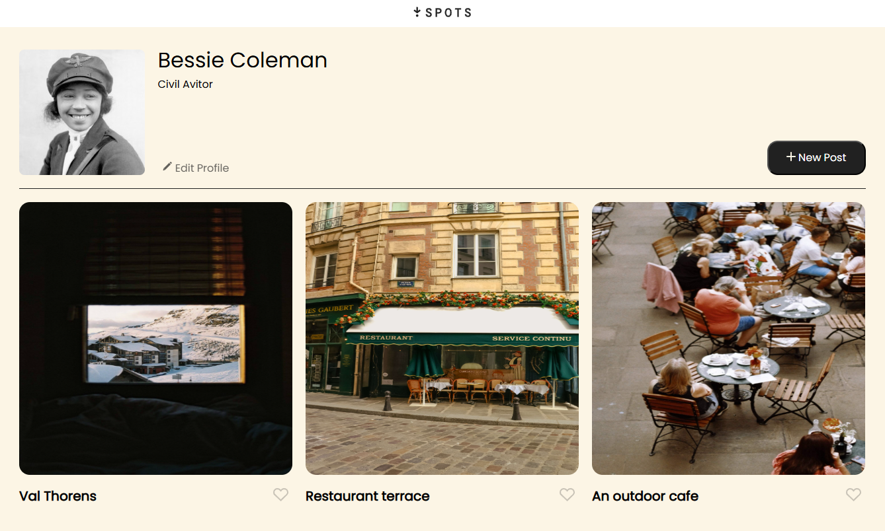

# Spots

## Description

Spots is a fully responsive web application that showcases a social media-style interface for sharing photos and locations. The project features a clean, modern design with user profiles, photo cards, and interactive elements. Built with semantic HTML and CSS, the application adapts seamlessly to different screen sizes and devices.

## Technologies and Techniques Used

- **HTML5**: Semantic markup structure
- **CSS3**: Advanced styling with Flexbox and Grid layouts
- **BEM Methodology**: Block Element Modifier naming convention for maintainable CSS
- **Responsive Design**: Mobile-first approach with media queries
- **Normalize.css**: Cross-browser consistency
- **Custom SVG Icons**: Scalable vector graphics for UI elements

## Features

- Responsive layout that works on desktop, tablet, and mobile devices
- User profile section with avatar and editing capabilities
- Interactive photo cards with like functionality
- Modal windows for viewing and adding content
- Smooth hover effects and transitions
- Optimized images for faster loading

## Links

- [Live Demo on GitHub Pages](https://gromero-ca.github.io/se_project_spots/)
- [Project Video](https://drive.google.com/file/d/1HxfxfEFtm_uq8NxXbj-ixBFjA_q58qMV/view?usp=sharing)
- [Figma Design](https://www.figma.com/file/BBNm2bC3lj8QQMHlnqRsga/Sprint-3-Project-%E2%80%94-Spots?type=design&node-id=2%3A60&mode=design&t=afgNFybdorZO6cQo-1)
